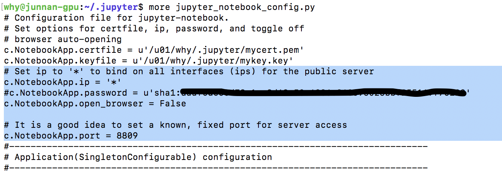

# 连接远程服务器
## 第一种：通过ssh连接

~ ssh why@amwork2017.55555.io -p 2212

## 第二种：通过OpenVPN连接服务器所在的LAN，下面的链接是在服务器（私网IP：10.1.1.12）上运行的一个container的jupyter

http://10.1.1.12:7771/

注释：

why@junnan-gpu:~$ sudo docker pull jaimeps/rl-gym

why@junnan-gpu:~$ sudo nvidia-docker run -d -p 7771:8888 jaimeps/rl-gym

why@junnan-gpu:~$ sudo docker exec -it 26abd8a9f6df bash

## 第三种：在服务器（私网IP：10.1.1.12）上运行jupyter notebook（端口8809）

https://amwork2017.55555.io:8809/

why@junnan-gpu:~$ nohup jupyter notebook > jupyter.out 2>&1 &

## 第四种：在服务器（私网IP：10.1.1.12）上运行tensorboard（端口6006），原理同第三种

## 下图展示了“虚拟服务器规则列表”

即必须从这里设置【外部端口】与【内部端口（即服务器的端口）】的映射规则

## 下图展示了“服务器所在的LAN的公网IP”

## 下图展示了“花生壳动态域名”，即amwork2017.55555.io

## 下图总结了上述的所有端口映射关系

# VirtualBox
## 搭建过程
### 需要为虚拟机配置两个网络适配器

### Adapter 1

### Adapter 2 (wrong)

### 发现错误

### 需要create a new adapter：192.168.56.1，子网掩码 255.255.255.0

### 这其实是一个gateway，网络的IP：192.168.56.0，广播的IP：192.168.56.255。虚拟机中的Adapter 1是enp0s3（inet: 10.0.2.15/24）即NAT，Adapter 2是enp0s8（inet: 192.168.56.101/24，这是私网IP，可通过MacBook的Terminal通过ssh连接，详见使用部分）即Host-Only Adapter

### Adapter 2 (correct)

### 注释：

### 边缘路由器（如上图）为MacBook分配的IPv4为192.168.3.32

### 下图中的VirtualBox Host-Only Network即是前述name为【vboxnet0】的Adapter 2，在windows操作系统中它与WLAN都在【网络连接（网络适配器）】中设置

## 使用
### ssh ubuntu@192.168.56.101

